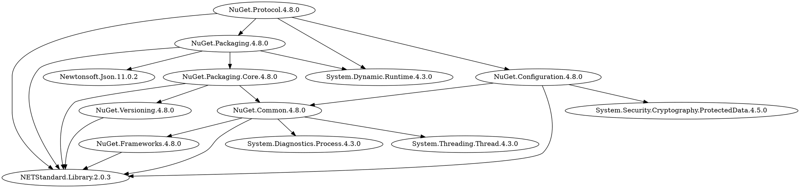

# NuGetTools

`Work in progress`

This project implements a command line tool with helper functions regarding [NuGet](https://www.nuget.org/) packages.

The current version supports displaying the dependency hierarchy of a given package.

---
## Features

The following are a list of the most important features supported by this tool:
- Dependency hierarchy:
    - List dependency hierarchy of a given package.
    - Support for custom NuGet feed URLs.
    - Show dependency hierarchy for a target [.NET framework](https://docs.microsoft.com/en-us/nuget/reference/target-frameworks).
    - Multiple output modes: tree, [DOT graph](https://en.wikipedia.org/wiki/DOT_(graph_description_language)).
    - Dependency and expansion exclusion filters.

---
## CLI

```shell
foo@bar:~$ dotnet JK.NuGetTools.Cli.dll --help
```

```
Usage: JK.NuGetTools.Cli [arguments] [options]

Arguments:
  PackageId                           The package identifier

Options:
  -s|--source-feed-url                The URL of the source feed. Default: "https://api.nuget.org/v3/index.json".
  -t|--target-framework               The target framework. Default: "Any".
  -wt|--writer-type                   The type of writer to use to print the dependencies. Default: "Tree".
  -def|--dependency-exclusion-filter  The exclusion Regex filters to apply on the dependencies of each package. Packages matching the filter will not be listed as dependencies of other packages and won't not be expanded. Default: "".
  -eef|--expansion-exclusion-filter   The exclusion Regex filters to apply on the parent of a given dependency branch. Packages matching the filter may be listed but their dependencies will not be expanded. Default: "".
  -u|--username                       Username to use for authenticated feed.
  -p|--password                       Password to use for authenticated feed.
  -?|-h|--help                        Show help information
```

---
## Example

The following examples show the dependency hierarchy of the package [`NuGet.Protocol`](https://www.nuget.org/packages/NuGet.Protocol/) for framework `netstandard2.0`, excluding the expansion of the common system namespaces.

### Tree

```shell
foo@bar:~$ dotnet JK.NuGetTools.Cli.dll NuGet.Protocol --target-framework netstandard2.0 -eef ^System -eef ^Microsoft -eef ^NETStandard
```
```
NuGet.Protocol.4.8.0
| NuGet.Packaging.4.8.0
| | NuGet.Packaging.Core.4.8.0
| | | NETStandard.Library.2.0.3
| | | NuGet.Common.4.8.0
| | | | System.Diagnostics.Process.4.3.0
| | | | NETStandard.Library.2.0.3
| | | | NuGet.Frameworks.4.8.0
| | | | | NETStandard.Library.2.0.3
| | | | System.Threading.Thread.4.3.0
| | | NuGet.Versioning.4.8.0
| | | | NETStandard.Library.2.0.3
| | System.Dynamic.Runtime.4.3.0
| | Newtonsoft.Json.11.0.2
| | NETStandard.Library.2.0.3
| NuGet.Configuration.4.8.0
| | NETStandard.Library.2.0.3
| | NuGet.Common.4.8.0
| | | System.Diagnostics.Process.4.3.0
| | | NETStandard.Library.2.0.3
| | | NuGet.Frameworks.4.8.0
| | | | NETStandard.Library.2.0.3
| | | System.Threading.Thread.4.3.0
| | System.Security.Cryptography.ProtectedData.4.5.0
| System.Dynamic.Runtime.4.3.0
| NETStandard.Library.2.0.3
```

### DOT graph

```shell
foo@bar:~$ dotnet JK.NuGetTools.Cli.dll NuGet.Protocol --target-framework netstandard2.0 -eef ^System -eef ^Microsoft -eef ^NETStandard --writer-type graph
```


The DOT graph output can be used with any DOT compatible visualizers, including some online tools like [Viz.js](http://viz-js.com/) or [WebGraphviz](http://www.webgraphviz.com/).

The example above generates the following graph in Viz.js:


---
## TODO

List of planned features:
- Display dependency hierarchy of a project file (`csproj`)
- Display dependency hierarchy of a solution file (`sln`)
- Display upstream packages (packages that depend on a given package).
- Support for multiple source feeds.
